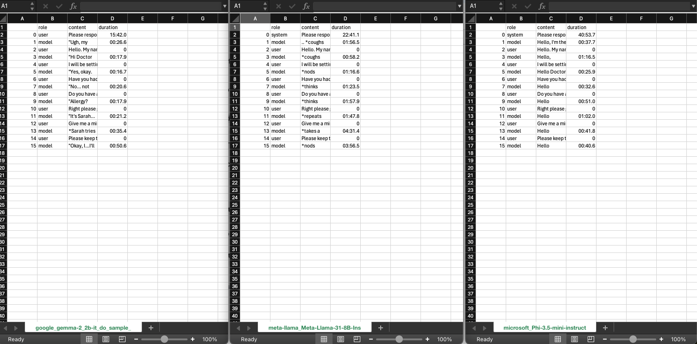

# vicctor_llm
VICCTOR is a virtual interactive core procedures training framework. Here we document how we integrate LLM into vicctor.

## Problem statement
We have developed a virtual clinical procedure training tool for students to practice procedural skills at home with Meta Quest Mixed Reality Headset. We used a fixed script in database for the user interaction. Wit.AI for text to speech and speech to text. However there are a few issues: 
- Interaction is scripted. We need a more natural interaction with the user. 
- WIT.AI service is intermittent and we want to provide a more reliable service to have seamless interaction.

## Aim
To evaluate and integrate the use of Large Language Model’s generative conversation and text-to-speech and speech-to-text capabilities to augment the existing system. 

This is a documentation of the process of tests and determine which is the best way to provide this service.

## Contents
[1. Determine the best model to use](#1-determine-the-best-model-to-use)

[2. Improve the speed of response](#2-improve-the-speed-of-response)\
	- [llama.cpp](#llamacpp) \
		- [Installation and run on MacBook Pro M3 Max](#installation-and-run-on-macbook-pro-m3-max)\
		- [Installation and run on Windows 11 OS with NVIDIA GPU RTX 2080ti](#installation-and-run-on-windows-11-os-with-nvidia-gpu-rtx-2080ti)

[3. Use local model for speech-to-text and text-to-speech](#3-use-local-model-for-speech-to-text-and-text-to-speech)

[4. Evaluate user input](#4-evaluate-user-input)

## 1. Determine the best model to use

1. We use an existing script, script.csv
2. Test the script on 3 popular models from hugging face.
    - google/gemma-2-2b-it (seems to have the best performance and speed of response using cpu)
    - meta-llama/Meta-Llama-3.1-8B-Instruct
    - microsoft/Phi-3.5-mini-instruct
3. Results


google/gemma-2_2b-it: 16.74 to 0:00:50.59\
meta-llama/Meta-Llama-31-8B-Instruct: 0:00:58.18 to 0:04:31\
microsoft/Phi-3.5-mini-instruct: 0:00:25.90 to 1:16.53

Notebook for installation and testing models

Measure effectiveness 
- user survey to measure which is the better model (tbd)
- duration (google seem to be faster running on my local machine)

Issues to overcome
- We might need to reduce the number of words the model respond. Now the model is too chatty. 
- In the response from the model, the words within asterisks sign shows the model’s body language. 
- Response duration is still too long. We need to improve the performance of the model.

[back to contents](#contents)

## 2. Improve the speed of response
The huggingface transformer implementation’s performance is still not satisfactory with a range of 16.7 to 50.6 seconds. We move on to enable using 

Advanced hardware
- MacBook Pro M3 Max (14 -core CPU, 30-core GPU and 16-core Neural Engine, 36GB unified memory) (mps)
- two GPU instances of NVIDIA RTX-3090.(cuda)
Advanced algorithm
- Deepspeed algorithm
- Llama.cpp


[MacBook Pro M3 Max](doc/google_gemma-2_2b-it_do_sample_max_new_tokens512_temperature07_topp09_topk0_repetition_penalty1_mps.csv)
mps: 0:00:08.79 to 0:00:26.21

[NVIDIA GPU RTX 3090](doc/google_gemma-2_2b-it_do_sample_max_new_tokens512_temperature07_topp09_topk0_repetition_penalty1_cuda.csv)
cuda: 0:00:2.37 to 0:00:4.18 (Nvidia GPU has the best performance)

[CPU](doc/google_gemma-2_2b-it_do_sample_max_new_tokens512_temperature07_topp09_topk0_repetition_penalty1_cpu_deepspeed.csv)
cpu with deep speed algorithm: 0:00:13.81 to 0:00:35.24\


NVIDIA GPU seems to be the best performing model. So we improved the performance for google/gemma-2_2b-it from 16.74 to 0:00:50.59 on my local machine to 0:00:2.37 to 0:00:4.18.

However the team finds that we need the system to perform fast and to be able to be called from an API call. So we went on to explore llama.cpp. 

[back to contents](#contents)

### llama.cpp 

llama.cpp is an open-source tool with minimal setup with state of the art performance. Here we used llama.cpp on a local machine MacBook Pro M3 Max (14 -core CPU, 30-core GPU and 16-core Neural Engine, 36GB unified memory) (mps). 

[lamma.cpp on MacBook Pro M3 Max](doc/google_gemma-2_2b-it_max_new_tokens128_temperature07_topp09_topk0_repeat_penalty1_mps_llamacpp.csv)
llama.cpp on mps: 0:00:02.50 to 0:00:17.40

This is a significant improvement from hugging face transformer mps: 0:00:08.79 to 0:00:26.21 to llama.cpp implementation of the model llama.cpp on mps: 0:00:02.50 to 0:00:17.40 on a local machine MacBook Pro M3 Max.

At the same time, we need to provide an API call. Llama.cpp provides HTTP server implementation. We set this up on a standalone Windows 11 OS with NVIDIA GPU RTX 2080ti.

<report on performance>

##### Installation and run on MacBook Pro M3 Max
1. Download and install miniconda.
   	```
	wget https://github.com/conda-forge/miniforge/releases/latest/download/Miniforge3-MacOSX-arm64.sh
	bash Miniforge3-MacOSX-arm64.sh
	```
3. Create condo environment and activate. 
	```
	conda create -n llama python=3.9.16 -y
	conda activate llama
	conda install mlx
	CMAKE_ARGS="-DLLAMA_METAL_EMBED_LIBRARY=ON -DGGML_METAL=on" pip install -U llama-cpp-python==v0.3.1 --no-cache-dir
	pip install 'llama-cpp-python[server]'
	pip install numpy==1.24.1
	pip install llama_cpp_agent
	git clone https://github.com/ggerganov/llama.cpp.git
	```
4. Download model and create guff
	```
	pip install safetensors
	pip install sentencepiece
	cd ~/projects/lift/llama.cpp/
	huggingface-cli download google/gemma-2-2b-it --local-dir google/gemma-2-2b-it
	ln -s /google/gemma-2-2b-it/ llama.cpp/models/gemma-2-2b-it
	python convert_hf_to_gguf.py --outtype bf16 google/gemma-2-2b-it/ --outfile models/gemma-2-2b-it/gemma-2-2b-it-bf16.gguf
	```
5. Run llama.cpp server
	```
	sudo apt install cmake
	cd ~/projects/lift/llama.cpp
	cmake -B build
	cmake --build build --config Release -t llama-server
	./build/bin/llama-server --list-devices
	./build/bin/Release/llama-server -m ./models/gemma-2-2b-it/gemma-2-2b-it-bf16.gguf -c 2048 --host 0.0.0.0 --port 8082 --temp 0.7 --top-k 6 --top-p 0.95 --min_p 0.05 --n_predict 128 --repeat-penalty 1 --prompt "Please respond as a patient in a hospital ward. You are feeling dehydrated." --seed 1234 --flash-attn --device Metal
	```
6. Call the service
	```
	curl --request POST --header "Content-Type: application/json" --data "{\"messages\":,\"n_predict\": 128,\"temperature\":0.7,\"top-k\":6,\"top-p\":0.95,\"min_p\":0.05,\"repeat_penalty\":1,\"model\":\"gemma-2-2b-it\",\"stop\":[\"exit\"],\"n_keep\":10,\"dynatemp_range\":0,\"dynatemp_exponent\":1,\"typical_p\":1,\"xtc_probability\":0,\"xtc_threshold\":0.1,\"repeat_last_n\":64,\"presence_penalty\":0,\"frequency_penalty\":0,\"dry_multiplier\":0,\"dry_base\":1.75,\"dry_allowed_length\":2,\"dry_penalty_last_n\":-1,\"cache_prompt\":true}" --url http://localhost:8082/chat/completions
	```
	Note: if you want the server to remember chat history, you will need to attend the chat history into messages.

[back to contents](#contents)


##### Installation and run on Windows 11 OS with NVIDIA GPU RTX 2080ti
1. Download and install miniconda in CMD using administrator. 
	```
	curl https://repo.anaconda.com/miniconda/Miniconda3-latest-Windows-x86_64.exe -o miniconda.exe
	```
2. Download and install git for Windows.
3. Git clone llama.cpp

	```
	mkdir ~/Documents/llm
cd ~/Documents/llm
 	git clone https://github.com/ggerganov/llama.cpp.git
 	```
5. Install Visual Studio, Visual Studio c++, C++ for Windows.
6. If you have a GPU, reinstall nvidia CUDA toolkit.
3. Create condo environment in Anaconda PowerShell Prompt using administrator.
	```
	conda create -n conda-llm
	conda activate conda-llm
	conda install pytorch torchvision torchaudio pytorch-cuda=12.4 -c pytorch -c nvidia
	pip install sentencepiece 
	pip install safetensors
	pip install tqdm
	```
4. Download model and create guff.
	```
	cd ~/Documents/llm/llama.cpp/
	huggingface-cli download google/gemma-2-2b-it --local-dir google/gemma-2-2b-it
	python convert_hf_to_gguf.py --outtype bf16 google/gemma-2-2b-it/ --outfile models/google/gemma-2-2b-it/gemma-2-2b-it-bf16.gguf
	```
5. Build llama.cpp server.
	```
	cmake -B build -DGGML_CUDA=ON
	cmake --build build --config Release -t llama-server
	```
6. Start service
	Anaconda Powershell Prompt using administrator
	```
	cd ~/Documents/llm/llama.cpp
	conda activate conda-llm
	./build/bin/Release/llama-server.exe -m ./models/google/gemma-2-2b-it/gemma-2-2b-it-bf16.gguf -c 2048 --host 0.0.0.0 --port 8082 --temp 0.7 --top-k 6 --top-p 0.95 --min_p 0.05 --n_predict 128 --repeat-penalty 1 --prompt "Please respond as a patient in a hospital ward. You are feeling dehydrated." --seed 1234 --flash-attn --device CUDA0
	```
	To change a GPU device you can use the code below to list the existing devices. 
	```
	./build/bin/Release/llama-server.exe --list-devices
	```
7. Call the service
	CMD using administrator
	```
	curl --request POST --header "Content-Type: application/json" --data "{\"messages\":[{\"role\": \"system\",\"content\": \"Please respond as a patient in a hospital ward. You are feeling dehydrated.\"},{\"role\": \"user\",\"content\": \"Hello. My name is Doctor Lu. I am the doctor taking care of you today. Can I have your name and NRIC number please?\"}],\"n_predict\": 128,\"temperature\":0.7,\"top-k\":6,\"top-p\":0.95,\"min_p\":0.05,\"repeat_penalty\":1,\"model\":\"gemma-2-2b-it\",\"stop\":[\"exit\"],\"n_keep\":10,\"dynatemp_range\":0,\"dynatemp_exponent\":1,\"typical_p\":1,\"xtc_probability\":0,\"xtc_threshold\":0.1,\"repeat_last_n\":64,\"presence_penalty\":0,\"frequency_penalty\":0,\"dry_multiplier\":0,\"dry_base\":1.75,\"dry_allowed_length\":2,\"dry_penalty_last_n\":-1,\"cache_prompt\":true}" --url http://localhost:8082/chat/completions
	```
	Note: if you want the server to remember chat history, you will need to attend the chat history into messages.

[back to contents](#contents)

## 3. Use local model for speech-to-text and text-to-speech
<tbd>

## 4. Evaluate use input
<tbd>

[back to contents](#contents)


